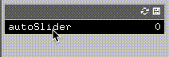

# ofxAutoFloatSlider



ofxGuiのofxFloatSliderを拡張したアドオンです。
ofxFloatSliderと同様に使用できる上で、キー入力などでofxFloatSliderの値を操作することができます。
ofxFloatSliderを継承しているため、使用するにはofxGuiを必要とします。
openFrameworks v0.10.1で動作を確認しています。

This is an add-on that extends ofxGui's ofxFloatSlider.
It can be used in the same way as ofxFloatSlider, and you can manipulate the value of ofxFloatSlider by key, button, etc.
Since it inherits from ofxFloatSlider, ofxGui is required to use it.
It has been tested with openFrameworks v0.10.1.

# usage 使い方
```
// ほぼofxFloatSliderと同様に使用します。自動で動かすためにupdate()を必要とします。
// It is used almost the same way as ofxFloatSlider, and requires update() to run automatically.

#include "ofxAutoFloatSlider.h"

ofxPanel gui;
ofxAutoFloatSlider autoSlider;

void ofApp::setup(){
    gui.add(autoSlider.setup("autoSlider", 0, 0, 1));
    autoSlider.speed = 1;
}
// update()を呼ぶ必要があります
// you need to call update()
void ofApp::update(){
    autoSlider.update();
}
//
void ofApp::draw(){
    gui.draw();
}
// 特定の関数を呼んで操作します。
// operate gui by calling these functions.
void ofApp::keyPressed(int key){
    if (key == OF_KEY_LEFT)  autoSlider.swicthBACK_STOP();
    if (key == OF_KEY_RIGHT) autoSlider.swicthFORWARD_STOP();
    if (key == OF_KEY_DOWN)  autoSlider.mode = ofxAutoFloatSlider::STOP;
}
```
また、guiのバーを右クリックすることでもスライダーを操作することができます。

You can also control the slider by right-clicking on the gui bar.